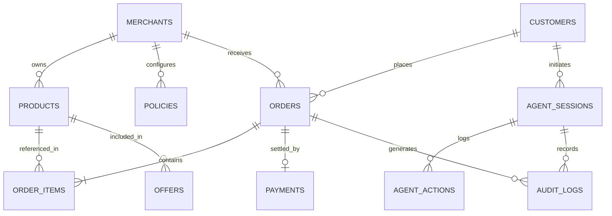

# MerchantPilot AI — Database Schema
**Relational Schema (SQLAlchemy ORM with SQLite / PostgreSQL support)**

---

## 1. Entity Relationship Overview

---

## 2. Table Specifications

### 1. `merchants`
- `id` (VARCHAR, Primary Key) - e.g., `"m_1001"`
- `name` (VARCHAR, Not Null) - e.g., `"Apex Electronics & Compute"`
- `email` (VARCHAR, Unique)
- `currency` (VARCHAR, Default `"INR"`)
- `created_at` (TIMESTAMP)

### 2. `products`
- `id` (VARCHAR, Primary Key) - e.g., `"P101"`
- `merchant_id` (VARCHAR, Foreign Key -> merchants.id)
- `name` (VARCHAR, Not Null) - e.g., `"Apex ProBook 15 Developer Edition"`
- `category` (VARCHAR, Indexed) - e.g., `"Laptops"`
- `description` (TEXT)
- `price` (FLOAT, Not Null) - Base price in INR
- `currency` (VARCHAR, Default `"INR"`)
- `stock` (INTEGER, Default 0)
- `rating` (FLOAT, Default 4.5)
- `specs` (JSON) - Machine-readable hardware attributes
- `compatible_product_ids` (JSON) - Array of compatible accessory product IDs
- `tags` (JSON) - Search indexing tags
- `is_active` (BOOLEAN, Default True)
- `created_at` (TIMESTAMP)

### 3. `policies`
- `id` (VARCHAR, Primary Key) - e.g., `"pol_default"`
- `merchant_id` (VARCHAR, Foreign Key -> merchants.id)
- `name` (VARCHAR, Not Null) - e.g., `"Standard Commercial Policy"`
- `max_discount_percentage` (FLOAT, Default 10.0)
- `max_discount_amount` (FLOAT, Default 6000.0)
- `max_transaction_amount` (FLOAT, Default 100000.0)
- `allowed_actions` (JSON) - List of permitted tool actions
- `restricted_actions` (JSON) - List of forbidden actions
- `require_human_approval` (BOOLEAN, Default True)
- `is_active` (BOOLEAN, Default True)
- `updated_at` (TIMESTAMP)

### 4. `customers`
- `id` (VARCHAR, Primary Key) - e.g., `"cust_101"`
- `name` (VARCHAR, Not Null)
- `email` (VARCHAR, Unique)
- `phone` (VARCHAR)
- `created_at` (TIMESTAMP)

### 5. `orders`
- `id` (VARCHAR, Primary Key) - e.g., `"ord_1001"`
- `merchant_id` (VARCHAR, Foreign Key -> merchants.id)
- `customer_id` (VARCHAR, Foreign Key -> customers.id, Nullable)
- `session_id` (VARCHAR, Nullable)
- `subtotal_amount` (FLOAT, Not Null)
- `discount_amount` (FLOAT, Default 0.0)
- `final_amount` (FLOAT, Not Null)
- `currency` (VARCHAR, Default `"INR"`)
- `status` (VARCHAR, Indexed) - `PENDING`, `AUTHORIZED`, `PAID`, `CANCELLED`, `FAILED`
- `is_ai_assisted` (BOOLEAN, Default False)
- `is_bundle` (BOOLEAN, Default False)
- `policy_approval_token` (VARCHAR, Nullable)
- `created_at` (TIMESTAMP)
- `updated_at` (TIMESTAMP)

### 6. `order_items`
- `id` (VARCHAR, Primary Key)
- `order_id` (VARCHAR, Foreign Key -> orders.id)
- `product_id` (VARCHAR, Foreign Key -> products.id)
- `quantity` (INTEGER, Default 1)
- `unit_price` (FLOAT, Not Null)
- `total_price` (FLOAT, Not Null)

### 7. `payments`
- `id` (VARCHAR, Primary Key)
- `order_id` (VARCHAR, Foreign Key -> orders.id)
- `razorpay_order_id` (VARCHAR, Indexed)
- `razorpay_payment_id` (VARCHAR, Indexed, Nullable)
- `razorpay_signature` (VARCHAR, Nullable)
- `amount` (FLOAT, Not Null)
- `currency` (VARCHAR, Default `"INR"`)
- `status` (VARCHAR) - `CREATED`, `AUTHORIZED`, `CAPTURED`, `FAILED`, `REFUNDED`
- `verification_status` (VARCHAR) - `UNVERIFIED`, `VERIFIED_HMAC`, `VERIFICATION_FAILED`
- `created_at` (TIMESTAMP)
- `updated_at` (TIMESTAMP)

### 8. `agent_sessions`
- `id` (VARCHAR, Primary Key) - e.g., `"sess_1001"`
- `customer_id` (VARCHAR, Nullable)
- `intent_summary` (TEXT, Nullable)
- `status` (VARCHAR) - `ACTIVE`, `CONVERTED`, `ABANDONED`, `BLOCKED`
- `created_at` (TIMESTAMP)
- `updated_at` (TIMESTAMP)

### 9. `agent_actions`
- `id` (VARCHAR, Primary Key)
- `session_id` (VARCHAR, Foreign Key -> agent_sessions.id)
- `tool_name` (VARCHAR, Not Null)
- `tool_input` (JSON)
- `tool_output` (JSON)
- `execution_time_ms` (FLOAT)
- `created_at` (TIMESTAMP)

### 10. `audit_logs`
- `id` (VARCHAR, Primary Key)
- `session_id` (VARCHAR, Nullable)
- `actor` (VARCHAR, Not Null) - `AI_BUYER`, `AI_MERCHANT_AGENT`, `POLICY_ENGINE`, `APPROVAL_GATE`, `RAZORPAY_SYSTEM`
- `intent` (VARCHAR, Nullable)
- `action` (VARCHAR, Not Null)
- `reason` (TEXT, Nullable)
- `input_data` (JSON, Nullable)
- `decision` (VARCHAR, Nullable) - `PERMITTED`, `BLOCKED`, `APPROVED`, `VERIFIED`
- `amount` (FLOAT, Nullable)
- `policy_checked` (VARCHAR, Nullable)
- `policy_result` (VARCHAR, Nullable) - `PASSED`, `VIOLATION`, `SKIPPED`
- `approval_result` (VARCHAR, Nullable) - `APPROVED`, `CANCELLED`, `PENDING`
- `razorpay_order_id` (VARCHAR, Nullable)
- `payment_id` (VARCHAR, Nullable)
- `final_result` (VARCHAR, Nullable)
- `failure_reason` (TEXT, Nullable)
- `created_at` (TIMESTAMP)
