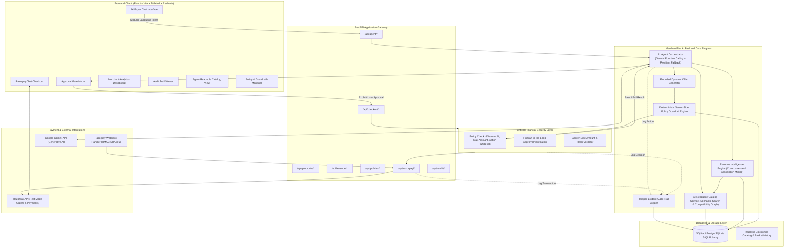

# MerchantPilot AI — Technical Architecture
**Razorpay AI Buildathon — Track 01: AI Growth & Agentic Commerce**

---

## 1. High-Level Architecture Diagram

---

## 2. Core Architectural Principles

### 1. Financial Security Isolation (Non-Trust AI Boundary)
- The Large Language Model (LLM) **NEVER** interacts directly with financial settlement or Razorpay endpoints.
- The LLM can only suggest parameter proposals via typed tool calls.
- The **Policy Engine** evaluates every proposal against strictly configured merchant rules (`max_discount_pct`, `max_discount_amount`, `max_transaction_amount`, `allowed_roles`).
- The **Approval Gate** enforces client confirmation on verified server-calculated amounts before any order creation occurs.

### 2. Explainable Revenue Intelligence
- Recommendation logic leverages co-occurrence probability, support, and lift computed over historical order baskets.
- The AI agent provides natural-language justifications for upsells and cross-sells directly derived from statistical affinity (e.g. *“82% of customers who bought this Laptop also purchased the Wireless Mouse”*).

### 3. Agentic Catalog Transparency
- Standard REST + JSON endpoints expose high-fidelity, machine-readable specifications: compatible accessories, power/port requirements, stock levels, and real-time merchant policy parameters.

### 4. Idempotent Payment & Webhook Architecture
- Razorpay order creation creates linked database order records in `PENDING` status.
- Signature verification verifies `razorpay_order_id`, `razorpay_payment_id`, and `razorpay_signature` via `HMAC-SHA256`.
- Webhooks handle asynchronous events idempotently with replay attack prevention.

---

## 3. Technology Stack Specification

- **Backend:** Python 3.12, FastAPI, Uvicorn, SQLAlchemy 2.0, Pydantic v2, Pandas, Scikit-learn, Razorpay SDK, Google Generative AI (Gemini).
- **Database:** SQLite (local development with PostgreSQL schema parity) + Seed datasets.
- **Frontend:** React 18, Vite, Tailwind CSS, Lucide React icons, Recharts data visualization, React Router v6.
- **Testing:** Pytest, pytest-asyncio, HTTPX, Coverage.
